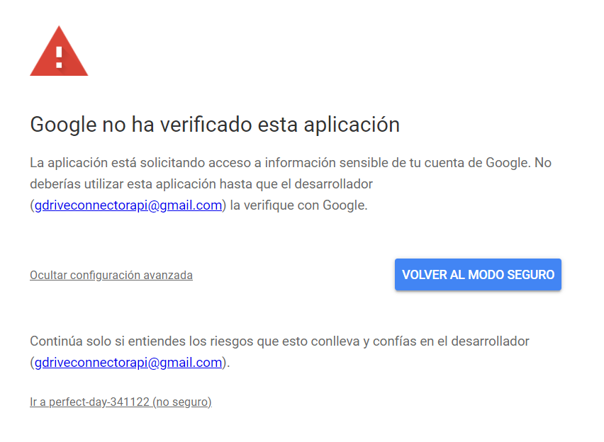

#Google Drive Connector

Elaborado por [Felipe Bedoya](https://trempo.github.io)

##Descarga

En la página de [GitHub](https://github.com/Trempo/googleDriveConnector) se encuentra el código fuente. Para descargarlo puede dar click [aquí](https://github.com/Trempo/googleDriveConnector/archive/refs/heads/main.zip).

##Instalación

### Instalación en ambiente virtual

Primero se crea el ambiente virtual en Python usando venv. Si el comando python no es reconocido puede intentar con python3 o añadiendo python al PATH.

Desde la consola estando en la carpeta del proyecto se ejecuta el comando:

    python -m venv /ruta/deseada/del/ambiente/virtual
    
Por ejemplo:

    python -m venv /Escritorio/GoogleDriveConnector

Luego se debe instalar los módulos necesarios para que funcione el programa.

    pip install -r requirements.txt

### Instalación global

Si no se desea usar un ambiente virtual, se puede instalar el programa estando con la consola en la carpeta raíz del proyecto:

    pip install -r requirements.txt

#### ¿Que instalación es la más recomendada?

Si utilizas otros módulos de python o tienes más de una versión de python instalada, se recomienda instalar el programa en un ambiente virtual.

##Funcionamiento:

#### Si se instaló el programa en un ambiente virtual:

Cada vez que desee utilizar el programa debe activar el ambiente virtual utilizando el siguiente comando desde la consola estando en la raíz del proyecto:

    ./Scripts/activate

Se puede acceder al menú de opciones desde la consola con el siguiente comando:

    python GoogleDriveConnector.py -h

Se deben pasar dos parámetros al programa, el ID de la carpeta la cual se desea descargar y la ruta en la cual se desea que se descarguen los archivos.

    python GoogleDriveConnector.py -i '1GSTGDuDNWqw0Huv6k5Tqn_sBXriN27Pj' -r './Escritorio/GoogleDrive'

Una vez ejecutado el programa se abrirá una pestaña del navegador pidiendo autenticarse en su cuenta de Google Drive. Dependiendo de la fecha en la que se intente acceder puede que diga no se ha verificado el proyecto. Esto se debe a que Google debe verificar la legitimidad del proyecto y puede demorar.

Cuando le aparezca la siguiente pestaña dele click en "Ir a perfect-day-341122 (no seguro)"

Después de haberse autenticado se descargaran los archivos y se eliminaran de Google Drive.

### Seguridad

Si tiene dudas respecto a la seguridad de sus datos, se ha utilizado una cuenta de Google nueva para conectarse con el API de Google Drive.

Las credenciales de la cuenta de Google son:

Correo: gdriveconnectorapi@gmail.com  
Contraseña: gdriveconnectorapi2022

Desde [aquí](https://console.developers.google.com/home/dashboard?authuser=2&project=perfect-day-341122) podrá ver la verificación del proyecto y las condiciones de autorización.

